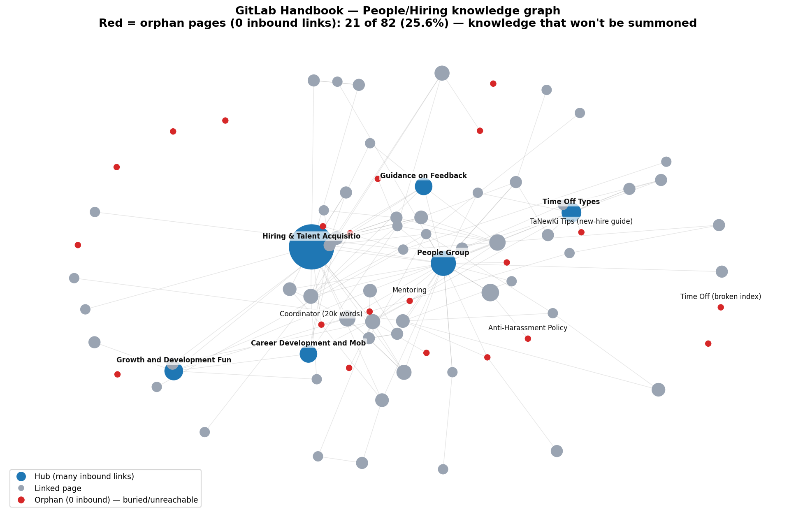

# knowledge-ops — Knowledge-on-Demand

**조직이 쌓아둔 지식이 정작 의사결정·온보딩 순간에 소환되지 않는 문제를, AI/LLM로 진단한다.**

비정형 지식을 그래프로 구조화해 ① 문제 상황에 맞는 지식 **소환**, ② **공백·중복·사일로 진단**, ③ **문서화/연결 우선순위 결정**을 낸다. *LLM이 엔진, 판단·검증은 사람.*



---

## 결과 한 줄
> **GitLab Handbook(People/Hiring) 82페이지 중 25.6%가 orphan** — 핸드북 안에서 링크로 소환되지 않는 지식. 신입 가이드·멘토링·핵심 정책까지 포함. **문제는 "문서 부족"이 아니라 "연결 부족"**이었고, 가장 적은 노력으로 소환성을 높일 **연결 보강 우선순위**를 도출했다.

→ 상세: **[docs/PORTFOLIO.md](docs/PORTFOLIO.md)** (1장 요약·면접 STAR) · **[outputs/handbook_diagnosis.md](outputs/handbook_diagnosis.md)** (진단)

## 무엇을 했나
1. **파이프라인 검증** — 개인 코퍼스(GitHub stars 28건)로 수집→프로파일링→지식그래프→"문제→지식 소환"을 구현·검증. (`collect_stars` → `profile_stars` → `build_graph`)
2. **실제 조직 적용** — 같은 파이프라인을 GitLab Handbook에 적용해 페이지=노드·내부링크=엣지로 그래프화, orphan·고립·허브를 진단. (`analyze_handbook`)
3. **AI투명성** — 구조지표는 결정적 계산, LLM/판단 개입분은 샘플 페이지를 직접 열어 **휴먼검증**한 것만 결론에 사용.

## 산출물
| 경로 | 내용 |
|---|---|
| `outputs/handbook_diagnosis.md` | 조직 진단 + 의사결정(핵심 산출물) |
| `outputs/profile_summary.md`, `outputs/graph_summary.md` | 개인 코퍼스 EDA·그래프 |
| `data/interim/*.csv` | 노드·엣지(재현용 외부화) |
| `docs/PROBLEM_DEFINITION.md` | 문제 정의(잠금) |
| `docs/DECISION_LOG.md` | 의사결정·피벗 기록(판단력 증빙) |
| `docs/NORTH_STAR.md` | 백워드 플래닝 기준 |

## 재현
```bash
# 개인 코퍼스
python src/collect_stars.py            # → data/raw/stars.json
python src/profile_stars.py            # → outputs/profile_summary.md
python src/build_graph.py              # → 그래프 + 문제→소환 데모

# 조직 코퍼스 (GitLab Handbook 일부를 sparse clone 후)
python src/analyze_handbook.py data/raw/handbook/content/handbook
```

## 구조
```
docs/    문제정의(잠금)·결정로그·포트폴리오·노스스타
src/     수집·프로파일·그래프·핸드북 분석 코드(표준 라이브러리)
data/    raw(원천 JSON)·interim(노드/엣지 CSV)
outputs/ 진단·EDA·그래프 리포트
```

> 모든 지표는 절대 점수가 아니라 **상대 비교·의사결정 보조**다.
